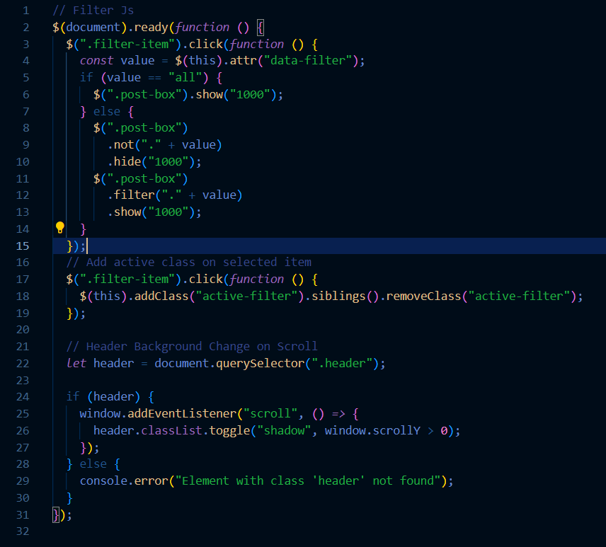
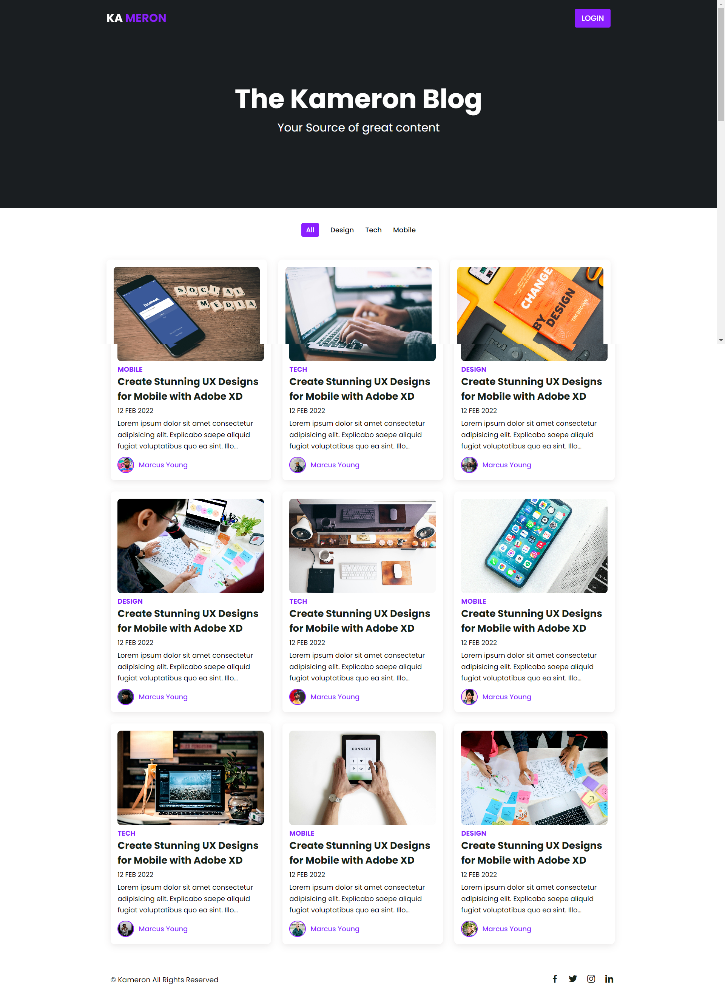

# **Responsive-blog-jQuery**

**Project Overview**
**Purpose:**
The Kameron Blog is a responsive and interactive blog website designed to provide users with engaging content across various categories. The application features a filterable post display, dynamic UI effects, and a clean design. It was deployed using AWS Amplify, ensuring scalable and reliable hosting.

**STAR Interview Questions**
**Situation:**
The Kameron Blog was developed to offer users a visually appealing and easily navigable platform to read and filter blog posts by categories such as Design, Tech, and Mobile. The goal was to create a seamless user experience with smooth transitions and dynamic content display.

**Task:**
The primary task involved designing and implementing a responsive blog website with a filterable post section. This included developing a clean and modern UI, adding dynamic filtering functionality, and deploying the application using AWS Amplify for scalable and reliable hosting.

**Action:**
The Kameron Blog was developed independently using a personal GitHub repository. The frontend was built using HTML, CSS, and JavaScript, with jQuery for DOM manipulation and dynamic content display. The deployment was handled by AWS Amplify, ensuring the application is scalable and accessible.

**Key code features include:**

**Result:**
The Kameron Blog successfully delivers a responsive and engaging user experience. Users can easily filter blog posts by categories, enjoy smooth transitions and dynamic UI effects, and read content across various topics. The deployment via AWS Amplify ensures the application is accessible and scalable, providing a reliable platform for users.

**Technologies Used**
**Frontend:** HTML, CSS, JavaScript, jQuery
**Deployment:** AWS Amplify
**UI/UX:** Dynamic content display, responsive design, jQuery for DOM manipulation

**Job Function Competencies**
**Job Function 2.4: Demonstrates commitment to continued professional development**
Developing the Kameron Blog demonstrated a strong commitment to continuous professional development. The project required learning and applying new skills in web development, dynamic content display, and deploying applications with AWS Amplify. This involved persistent learning and experimentation.

**Job Function 3.3: Understands how to develop effective user interfaces**
In developing the user interface (UI) for the Kameron Blog, I prioritized creating an intuitive and visually appealing experience. Leveraging HTML, CSS, and jQuery, I designed a clean and responsive UI that effectively supports content filtering and dynamic display.

**Job Function 3.5: Understands how to follow software designs and functional/technical specifications**
The development of the Kameron Blog adhered to clear software design and functional/technical specifications. The project began with a detailed outline of features, including post filtering, dynamic UI effects, and responsive design. Each feature was meticulously planned and implemented to meet these specifications, ensuring a cohesive and functional application.

**Job Function 4.7: Understands how to apply algorithms, logic, and data structures**
Understanding algorithms, logic, and data structures was crucial for implementing efficient solutions in the Kameron Blog. This included managing DOM manipulation with jQuery, handling filter logic, and ensuring smooth transitions. By applying logical structures and algorithms, the application operates smoothly and meets user expectations.

